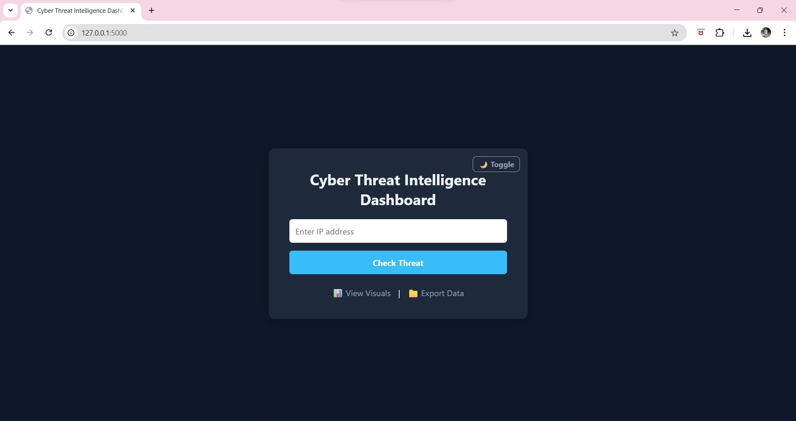
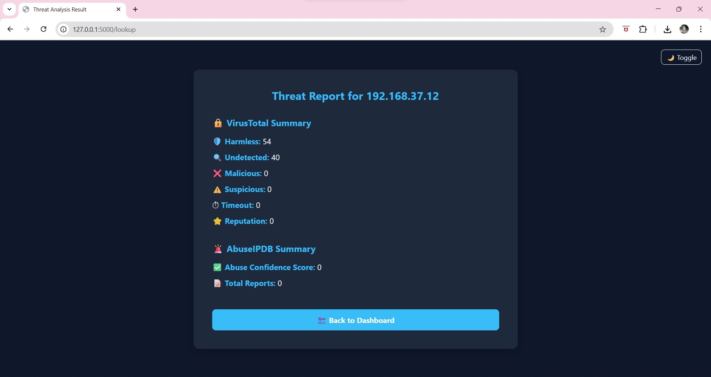

# 🛡️ Cyber Threat Intelligence Dashboard

A sleek and powerful dashboard that allows users to scan IP addresses using **VirusTotal** and **AbuseIPDB** APIs. Built with Flask and MongoDB, it provides real-time threat intelligence with visual charts and dark/light theme toggle.

---

## 📸 Screenshots

### 🔹 Home Page – IP Threat Scanner


### 🔹 Threat Analysis Result


> _These images show the clean dark-mode UI, IP lookup form, and threat analysis summary using VirusTotal & AbuseIPDB APIs._

---

## 🚀 Features

- 🔍 **IP Lookup** using VirusTotal and AbuseIPDB APIs
- 📊 **Visual Report** with Abuse Confidence Scores
- 💡 **Dark/Light Mode Toggle**
- 💾 **MongoDB Storage**
- 📁 **CSV Export Option**
- ⏳ **Loading Spinner on Submit**
- 🎯 Responsive and Minimal UI

---

## 🧠 Tech Stack

- **Frontend**: HTML5, CSS3, JavaScript, Chart.js  
- **Backend**: Python (Flask)  
- **Database**: MongoDB  
- **APIs**: VirusTotal, AbuseIPDB  

---

## 📁 Project Structure

```
cyber-threat-intel-dashboard/
├── templates/
│   ├── index.html
│   ├── result.html
│   └── visuals.html
├── utils/
│   ├── init.py
│   ├── vt_api.py
│   └── abuse_api.py
├── home.png
├── result.png
├── app.py
└── README.md
```

---

## ✍️ Author

**Krathan N Shetty**  
🎓 BCA Cybersecurity | Student |  Cybersecurity Enthusiast
🔗 [LinkedIn](https://www.linkedin.com/in/shettykrathan)

---

🆓 You are free to use, modify, and redesign this project for your own learning or deployment purposes.
